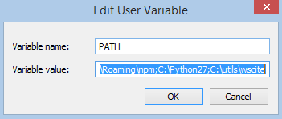
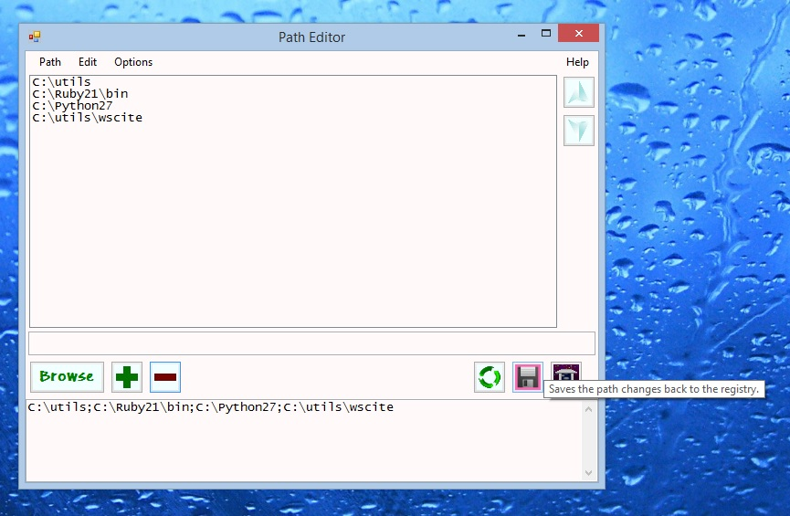

# PathEditor

## Synopsis:

The "path" list is stored as a string, so the traditional way of editing it is through a small, single-row text input field, like this:

Within the string it still a list.  This program edits it as a list, like this:

## Capabilities:
* View/Edit the User Path as a list instead of a string.
* Add path components either by navigating or typing.
* Change the order of path items by moving them up or down in the list.
* Remove path components with a couple of clicks.

